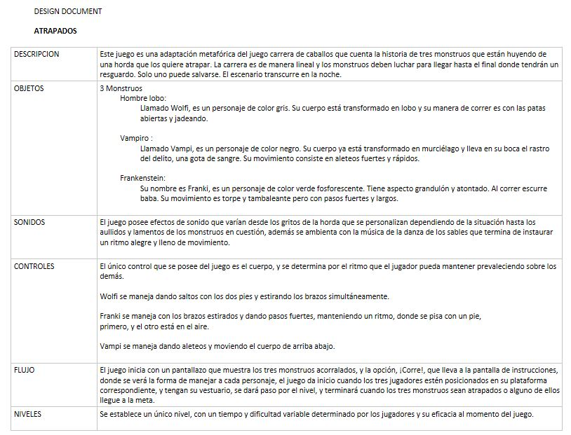
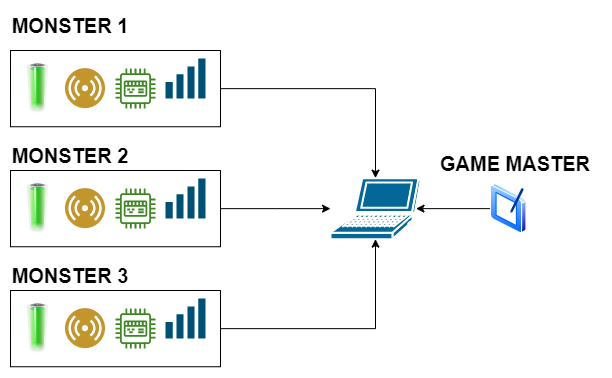

INTRODUCCIÓN AL CURSO 
=======================

Descripción del curso
----------------------

El objeto de este curso es aportar a las competencias que te permitan construir aplicaciones 
interactivas que pueda intercambiar información con varios dispositivos de cómputo externos 
que tengan la capacidad de leer y/o modificar el mundo físico . El curso se estructura alrededor 
de un proyecto que permita trabajar conceptos tales como comunicaciones inalámbricas, protocolos 
de comunicación híbridos, sockets udp, técnicas de programación multihilo y máquinas de estado. 
La aplicación deberá intercambiar información de manera inalámbrica con dos o más dispositivos 
de cómputo y podrá ser controlada remotamente por otra aplicación. La aplicación interactiva 
construida se publicará en un repositorio público y hará parte de tu portafolio.

Algunos ejemplos de este tipo de aplicaciones:

* `Interactive <https://momentfactory.com/reel/interactive-demo>`__ Momento Factory.
* `Lumia <https://momentfactory.com/reel/lumina-night-walks-demo>`__ de Moment Factory.
* `TDAxis <https://tdaxis.github.io/>`__.
* `RisitasCorp <https://github.com/juanferfranco/RisitasCorp_Rider>`__ y 
  `RisitasCorpApp <https://github.com/juanferfranco/RisitasCorp_App>`__.
* `Proyecto Cosmere <https://github.com/juanferfranco/FisInt2>`__.
* `Proyecto WEM_23 <https://github.com/juanferfranco/WEM_23>`__.
* `Proyecto Los Repartidores <https://github.com/juanferfranco/INTERACTIVOS_2_REPARTIDOR>`__.

Propósito del curso
---------------------

Se espera que al finalizar el curso seas capaz de construir una aplicación 
interactiva que pueda intercambiar información con múltiples sistemas de cómputo externos 
que tengan la capacidad de leer y/o modificar el mundo físico. Para este fin te propondré un 
tema o una situación problemática que debes resolver seleccionando las técnicas 
de programación y protocolos más adecuados (nivel autónomo) según los requerimientos. 

Competencia
------------

Entretenimiento digital tiene 5 tipos de cursos: contenidos digitales, diseño, 
ingeniería de software, materialización y gestión e innovación TIC. 
Este curso es del tipo materialización. Los cursos del área de materialización buscan 
que puedas desarrollar las competencias necesarias para solucionar problemas de 
interacción integrando lo que has aprendido de ingeniería de software, construcción 
de contenidos digitales y diseño interactivo.

La competencia específica a la que apunta este curso es:

Materializa sistemas intermediados por el entretenimiento digital para resolver problemas 
de acuerdo con requerimientos condicionados por el contexto

Resultados de aprendizaje
----------------------------

.. note:: RESULTADO DE APRENDIZAJE

    Integro dispositivos de entrada-salida con sistemas de cómputo para la creación de sistemas 
    intermediados por el entretenimiento digital según los requisitos definidos.

    ``NIVEL: autónomo.``

¿Qué significa el nivel autónomo?

Significa que dado un problema tu debes seleccionar los conceptos y herramientas más 
apropiadas para conseguir una solución óptima al problema.

¿Eso quiere decir que hay más niveles?

Si. Receptivo, resolutivo y estratégico.

Carta descriptiva
-------------------

En `este <https://github.com/juanferfranco/SistemasFisicosInteractivos2/tree/main/docs/_static/cartaDescriptiva.xlsm>`__ enlace 
puedes revisar la carta descriptiva del curso.

Metodología del curso
----------------------

Este curso se ofrece en modalidad proyecto. En esta modalidad se propone un problema que 
deberás abordar mediante un proyecto de curso.

¿Qué haremos entonces en las sesión presencial?

* Presentar avances del proyecto
* Retroalimentar el proceso
* Realizar algunos talleres
* Analizar algunos casos de estudio.

¿Qué harás en el tiempo autónomo?

* Trabajar en los prototipos del proyecto.

Entregas
-----------

* Prototipo 1: diseño de la aplicación e integración con el primer dispositivo.
* Prototipo 2: ajustes al diseño de la aplicación e integración con dos dispositivos.
* Prototipo 3: ajustes al diseño de la aplicación e integración con dos dispositivos y 
  aplicación de control externa.	
* Prototipo 4: versión final de la aplicación y publicación del portafolio.	

Cronograma
-----------

=========== ==================  ===================== =====================
Evaluación  Plazo 1 (sobre 5)   Plazo 2 (sobre 5)     Plazo 3 (sobre 4)
=========== ==================  ===================== ===================== 
Prototipo 1 semana 4 ago 7      semana 5              semana 6
Prototipo 2 semana 7 ago 28     semana 8              semana 9
Prototipo 3 semana 12 oct 2     semana 13             semana 14
Prototipo 4 semana 15 oct 23    no hay                semana 16
=========== ==================  ===================== ===================== 

* Ten presente que te reportaré al SIGAA siempre en el plazo 1. Si entregas en los 
  plazos posteriores de modificaré la nota. Luego del plazo 3 la nota quedará 
  en cero.
* Solo se recibirán los prototipos con todas los requisitos solicitados. La nota 
  para un prototipo incompleto será 0. Mira por favor muy bien las condiciones de entrega 
  para cada prototipo.

Porcentajes
-----------

* Prototipo 1: 30%
* Prototipo 2: 20%
* Prototipo 3: 30%
* Prototipo 4: 20%

Dedicación 
------------

* Las asesorías presenciales serán de 1 hora 40 minutos.
* El trabajo autónomo del curso será de 4 horas.

Proyecto de curso
--------------------

Vamos a implementar un BIG GAME con un objetivo de diseño meramente lúdico. 

El juego a implementar se llama ATRAPADOS. Fue diseñado en el año 2014 por:

* Alejandro Vanegas.
* Nelson Carvajal.
* Stephanie Rivera.
* Andrés Medina.

`Aquí <https://youtu.be/OD44njx0Wh4>`__ puedes ver un game play simulado del juego.

El documento de diseño original:

|

`Aquí <https://drive.google.com/drive/folders/0B0FEIQwvlT4MN2pUd0JRdnlVMjA?resourcekey=0-cSomz0TgoCQmvo9f_sXdLQ&usp=share_link>`__ 
puedes ver algunas fotos de las pruebas de usuario.

Conceptualmente el sistema de cómputo distribuido que implementarás es este:

   Diagrama conceptual de los componentes del juego

Condiciones de entrega 
-----------------------

Para los prototipos 1 a 3

* El código de todos los proyectos de software involucrados.
* Explicar el diseño conceptual de la aplicación.
* Enlace a un video con el resultado final del prototipo funcionando.

Para el prototipo 4:

* Versión final del código de todos los dispositivos de cómputo involucrados.
* Explicar el diseño conceptual de la aplicación.
* Un documento tipo tutorial con el cual una persona que no conozca 
  tu proyecto pueda reproducirlo y probarlo.
* El enlace a un video donde muestres en funcionamiento el prototipo final.
* Un enlace a tu portafolio donde se vea la publicación de este trabajo.

.. note:: PRESENTACIÓN FINAL 

  En la última sesión del curso, en la semana 16 presentarás tu trabajo 
  a los compañeros.

Te voy a dejar algunas ideas de portafolio y cómo puedes mostrar tu trabajo:

* `Un portafolio <https://www.jellever.be/>`__ ejemplo que me gusta mucho.
* `Un video <https://youtu.be/CTvbuqRCoKk>`__ donde puedes ver una manera interesante 
  de presentar un proyecto y el proceso para llegar a ese resultado.

Repositorio para las entregas
-------------------------------

En `este <https://classroom.github.com/a/lp09VZsi>`__ repositorio deberás entregar tus prototipos.

Tablero de clase
------------------

`Tablero <https://upbeduco-my.sharepoint.com/:wb:/g/personal/juanf_franco_upb_edu_co/EaEbUCuFdDlHi26CSt36qdwBwwlp-F_Zjtj9YeQNMck9lQ?e=GVdzE2>`__ 
del curso.
