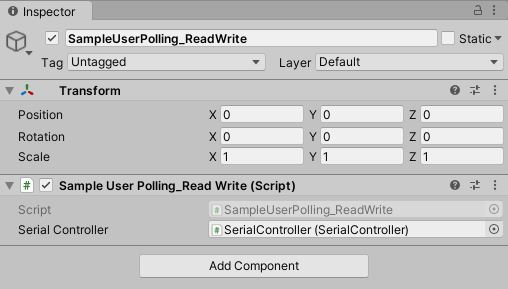
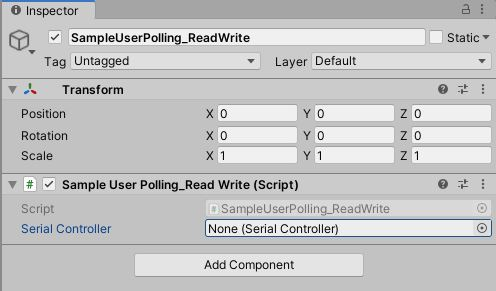

Unidad 1. Comunicaciones seriales
==============================================

Introducción
--------------

En esta primera unidad vamos a repasar algunos aspectos importantes de cursos anteriores. 
Entre los aspectos a revisar están:

* Comunicaciones seriales mediante protocolos ASCII y binarios
* Técnicas de programación concurrente y programación orientada
  a objetos.

Adicionalmente, en esta unidad vamos a repasar el uso de herramientas
de trabajo en equipo bajo control de versión.

Propósito de aprendizaje
***************************

Crear aplicaciones interactivas de tiempo real que integren
sensores y actuadores mediante puertos seriales utilizando protocolos
de comunicación binarios y ASCII.

Aplicar herramientas de control de versión al desarrollo del proyecto.

Evaluación de la Unidad 1
----------------------------

.. warning:: FECHA DE ENTREGA

    Agosto 11 de 2022 en la sesión presencial.

Enunciado
************

Construye una aplicación interactiva que integre CONTENIDO DIGITAL, INGENIERÍA DE SOFTWARE Y
DISEÑO para resolver un problema simple. 

* Define un juego simple (te propongo PONG) que quieras usar. Busca en Github el código fuente del proyecto 
  en Unity. Realiza un fork y configura el proyecto para trabajar en equipo.
* Vas a crear dos controles que se conectarán a la aplicación interactiva por medio 
  de puertos seriales.
* La aplicación debe tener una pantalla de configuración donde seleccionarás y configurarás 
  los controles: puerto serial, velocidad, protocolo de comunicación.
* Cada controlador debe soportar la posibilidad de comunicarse mediante un protocolo ASCII 
  o un protocolo binario.

Entrega
*********

* Vas a trabajar tu proyecto en `este <https://classroom.github.com/a/ZXy_lP5X>`__ repositorio.
* En el archivo README.md vas a incluir TODA la documentación solicitada:
  
  * Inserta la URL de un video (en youtube) que muestre en funcionamiento el proyecto.
  * Inserta imágenes con capturas de pantalla de las diferentes partes de la aplicación.
  * ``Explica detalladamente`` cómo funciona el proyecto: cómo está construida la pantalla de
    configuración de los controles, cómo se integra esta pantalla al juego, cómo se regresa
    a la pantalla de configuración.
  * ``Explica detalladamente`` cómo se integran los controlas a la aplicación interactiva. No 
    olvides explicar el código del control y el código en Unity. FUNDAMENTAL explicar el 
    protocolo de comunicación.

Calificación
**************

* EL proyecto solo se considera entregado cuando FUNCIONE AL 100% y esté documentado al 
  100%. Una vez logres esto la nota es 5.
* Si entregas completo SOLO el funcionamiento la nota es 3.
* Cualquier entrega parcial que evidencie trabajo en equipo y dedicación tendrá una nota de 2.
* Entregas parciales que no evidencien trabajo en equipo y muestren una dedicación pobre 
  tendrá una nota de 1.
* No entregar tendrá una nota de 0.

Trayecto de actividades
--------------------------

Es posible que necesites repasar algunos conceptos de cursos anteriores para solucionar el 
proyecto. Por tanto, te voy a dejar unos ejercicios que te ayudarán.

Ejercicio 1: Git y GitHub 
******************************

* Vas a ver el siguiente `playlist <https://www.youtube.com/watch?v=NB1womcQm7g&list=PLNoRsahkiuzWzJ18HSWT8ArYsi1gxFExm>`__
* Luego de verlo, vas a repetir el playlist, pero esta vez vas a reproducir los ejercicios 
  que están allí con un compañero, al menos.
* Repite los procesos anteriores PERO ESTA VEZ DE MEMORIA.

.. warning:: REVISIÓN LA PRÓXIMA SEMANA DE ESTE TRABAJO.

    Muestra al profesor el resultado de este ejercicio.

Ejercicio 2: ESP32 
******************************

En este curso vas a trabajar con el controlador `ESP32 <https://www.didacticaselectronicas.com/index.php/sistemas-de-desarrollo/espressif-systems/esp32/tarjeta-de-desarrollo-esp32-wrover-b-tarjetas-modulos-de-desarrollo-de-con-wifi-y-bluetooth-esp32u-comunicaci%C3%B3n-wi-fi-bluetooth-esp32u-iot-esp32-nodemcu-wrover-devkit-detail>`__ 
y con el framework de arduino. Actualmente hay dos versiones del IDE. Vas a trabajar con la más estable, es decir,
la 1.8.19. El link con las urls para las descargas de las diferentes versiones de IDE está 
`aquí <https://www.arduino.cc/en/software>`__. Te recomiendo que descargues la versión .zip y una vez 
descomprimas el archivo, antes de abrir el IDE de arduino, crea la carpeta ``portable``.

Para trabajar con el ESP32 debes instalar el soporte para esta plataforma en el IDE de
arduino como indica `este <https://docs.espressif.com/projects/arduino-esp32/en/latest/installing.html>`__ 
sitio.

¿Qué espero qué hagas en este ejercicio?

* Compra el ESP32.
* Instala el nuevo entorno de desarrollo.
* Configura el nuevo entorno.
* Realiza un programa de prueba que DE MANERA no BLOQUEANTE lea del puerto serial 
  el carácter ASCII 1 y responda con la cadena ``Hola mundo`` y con el carácter ASCII 2 responda 
  la cadena ``Chao mundo``.

Ejercicio 3: lee la documentación del ESP32 arduino core  
**********************************************************

Con este ejercicio quiero que EXPLORES y que busques todo lo que te cause 
curiosidad acerca de la documentación oficial del PORT de arduino para el ESP32.
El repositorio oficial es `este <https://github.com/espressif/arduino-esp32>`__. 
La página oficial con la documentación es `esta <https://docs.espressif.com/projects/arduino-esp32/en/latest/index.html>`__.

Ejercicio 4: protocolos ASCII
******************************

Vamos a recordar cómo integrar un sensor a Unity mediante el uso
de protocolos ASCII. ¿Recuerdas Ardity?

Lo primero que debes hacer es asegurarte que Ardity funciona.
Te dejo de nuevo una guía con la cual puedes recordar cómo hacerlo.
`Aquí <https://docs.google.com/presentation/d/1yNiycicVK9W4Fbeb-A8wFh6kP7vpAAaL_5aoCfUVWaU/edit?usp=sharing>`__ 
está la guía

Analicemos en detalle el DEMO. Primero, vamos a analizar el código de arduino:

.. code-block:: cpp

    uint32_t last_time = 0;
    
    void setup()
    {
        Serial.begin(9600);
    }
    
    void loop()
    {
        // Print a heartbeat
        if (millis() > last_time + 2000)
        {
            Serial.println("Arduino is alive!!");
            last_time = millis();
        }
    
        // Send some message when I receive an 'A' or a 'Z'.
        switch (Serial.read())
        {
            case 'A':
                Serial.println("That's the first letter of the abecedarium.");
                break;
            case 'Z':
                Serial.println("That's the last letter of the abecedarium.");
                break;
        }
    }

Consideraciones a tener presentes con este código:

* La velocidad de comunicación es de 9600. Esa misma velocidad se tendrá que configurar
  del lado de Unity para que ambas partes se puedan entender.
* Nota que nos estamos usando la función delay(). Estamos usando millis para medir tiempos
  relativos. Noten que cada dos segundos estamos enviando un mensaje indicando que el
  arduino está activo:  ""Arduino is alive!!""
* Observa que el buffer del serial se lee constantemente. NO estamos usando
  el método available() que usualmente utilizamos, ¿Recuerda? Con available() nos aseguramos
  que el buffer de recepción tiene al menos un byte para leer; sin embargo, cuando usamos
  Serial.read() sin verificar antes que tengamos datos en el buffer, es muy posible que
  el método devuelva un -1 indicando que no había nada en el buffer de recepción.
* Por último nota que todos los mensajes enviados por arduino usan el método println.
  ¿Y esto por qué es importante? porque println enviará la información que le pasemos
  como argumento codificada en ASCII y adicionará al final 2 bytes: 0x0D y 0x0A. Estos
  bytes serán utilizados por Ardity para detectar que la cadena enviada por Arduino está completa.

Ahora analicemos la parte de Unity con Ardity. Para ello, carguemos una de las escenas ejemplo:
DemoScene_UserPoll_ReadWrite

.. image:: ../_static/scenes.jpg
   :scale: 100%
   :align: center
   :alt: scenes

Nota que la escena tiene 3 gameObjects: Main Camera, SerialController y SampleUserPolling_ReadWrite.

Veamos el gameObject SampleUserPolling_ReadWrite. Este gameObject tiene dos components, un transform
y un script. El script tiene el código como tal de la aplicación del usuario.

Nota que el script expone una variable pública: serialController. Esta variable es del tipo SerialController.

.. image:: ../_static/serialControllerVarCode.jpg
   :scale: 100%
   :align: center
   :alt: serialController

Esa variable nos permite almacenar la referencia a un objeto tipo SerialController. ¿Donde estaría ese
objeto? Pues cuando el gameObject SerialController es creado note que uno de sus componentes es un objeto
de tipo SerialController:

.. image:: ../_static/serialControllerGO_Components.jpg
   :scale: 100%
   :align: center
   :alt: components

Entonces desde el editor de Unity podemos arrastrar el gameObject SerialController al campo SerialController
del gameObject SampleUserPolling_ReadWrite y cuando se despligue la escena, automáticamente se inicializará
la variable serialController con la referencia en memoria al objeto SerialController:

.. image:: ../_static/serialControllerUnityEditor.jpg
   :scale: 100%
   :align: center
   :alt: Editor

De esta manera logramos que el objeto SampleUserPolling_ReadWrite tenga acceso a la información
del objeto SerialController.

Observemos ahora qué datos y qué comportamientos tendría un objeto de tipo SampleUserPolling_ReadWrite:

.. code-block:: csharp

    /**
     * Ardity (Serial Communication for Arduino + Unity)
     * Author: Daniel Wilches <dwilches@gmail.com>
     *
     * This work is released under the Creative Commons Attributions license.
     * https://creativecommons.org/licenses/by/2.0/
     */

    using UnityEngine;
    using System.Collections;

    /**
     * Sample for reading using polling by yourself, and writing too.
     */
    public class SampleUserPolling_ReadWrite : MonoBehaviour
    {
        public SerialController serialController;

        // Initialization
        void Start()
        {
            serialController = GameObject.Find("SerialController").GetComponent<SerialController>();

            Debug.Log("Press A or Z to execute some actions");
        }

        // Executed each frame
        void Update()
        {
            //---------------------------------------------------------------------
            // Send data
            //---------------------------------------------------------------------

            // If you press one of these keys send it to the serial device. A
            // sample serial device that accepts this input is given in the README.
            if (Input.GetKeyDown(KeyCode.A))
            {
                Debug.Log("Sending A");
                serialController.SendSerialMessage("A");
            }

            if (Input.GetKeyDown(KeyCode.Z))
            {
                Debug.Log("Sending Z");
                serialController.SendSerialMessage("Z");
            }

            //---------------------------------------------------------------------
            // Receive data
            //---------------------------------------------------------------------

            string message = serialController.ReadSerialMessage();

            if (message == null)
                return;

            // Check if the message is plain data or a connect/disconnect event.
            if (ReferenceEquals(message, SerialController.SERIAL_DEVICE_CONNECTED))
                Debug.Log("Connection established");
            else if (ReferenceEquals(message, SerialController.SERIAL_DEVICE_DISCONNECTED))
                Debug.Log("Connection attempt failed or disconnection detected");
            else
                Debug.Log("Message arrived: " + message);
        }
    }

Vamos a realizar una prueba. Pero antes configuremos el puerto serial en el cual está conectado
el arduino. El arduino ya debe estar corriendo el código de muestra del sitio web del plugin.

.. image:: ../_static/serialControllerCOM.jpg
   :scale: 100%
   :align: center
   :alt: COM

En este caso el puerto es COM4.

Corre el programa, abre la consola y seleccione la ventana Game del Unitor de Unity. Con la ventana
seleccionada (click izquierdo del mouse), escriba las letras A y Z. Notarás los mensajes que aparecen
en la consola:

.. image:: ../_static/unityConsole.jpg
   :scale: 100%
   :align: center
   :alt: Console

Una vez la aplicación funcione note algo en el código de SampleUserPolling_ReadWrite:

.. code-block:: csharp

    serialController = GameObject.Find("SerialController").GetComponent<SerialController>();

Comenta esta línea y corre la aplicación de nuevo. Funciona?

Ahora, descomenta la línea y luego borre la referencia al SerialController en el editor de Unity:

Corre de nuevo la aplicación.

* ¿Qué podemos concluir?
* ¿Para qué incluyó esta línea el autor del plugin?

Ahora analicemos el código del método Update de SampleUserPolling_ReadWrite:

.. code-block:: csharp

    // Executed each frame
    void Update()
    {
      .
      .
      .
      serialController.SendSerialMessage("A");
      .
      .
      .
      string message = serialController.ReadSerialMessage();
      .
      .
      .
    }

¿Recuerda cada cuánto se llama el método Update? Ese método se llama en cada frame de la
aplicación. Lo llama automáticamente el motor de Unity

Nota los dos métodos que se resaltan:

.. code-block:: csharp

    serialController.SendSerialMessage("A");
    string message = serialController.ReadSerialMessage();

Ambos métodos se llaman sobre el objeto cuya dirección en memoria está guardada en
la variable serialController.

El primer método permite enviar la letra A y el segundo permite recibir una cadena
de caracteres.

* ¿Cada cuánto se envía la letra A o la Z?
* ¿Cada cuánto leemos si nos llegaron mensajes desde el arduino?

Ahora vamos a analizar cómo transita la letra A desde el SampleUserPolling_ReadWrite hasta
el arduino.

Para enviar la letra usamos el método SendSerialMessage de la clase SerialController. Observe
que la clase tiene dos variables protegidas importantes:

.. image:: ../_static/serialControllerUMLClass.jpg
   :scale: 35%
   :align: center
   :alt: UMLClass

.. code-block:: csharp
   
   protected Thread thread;
   protected SerialThreadLines serialThread;

Con esas variables vamos a administrar un nuevo hilo y vamos a crear referenciar un objeto
de tipo SerialThreadLines.

En el método onEnable de SerialController tenemos:

.. code-block:: csharp
   
   serialThread = new SerialThreadLines(portName, baudRate, reconnectionDelay, maxUnreadMessages);
   thread = new Thread(new ThreadStart(serialThread.RunForever));
   thread.Start();

Aquí vemos algo muy interesante, el código del nuevo hilo que estamos creando será RunForever y
ese código actuará sobre los datos del objeto cuya referencia está almacenada en serialThread.

Vamos a concentrarnos ahora en serialThread que es un objeto de la clase SerialThreadLines:

.. code-block:: csharp
   
    public class SerialThreadLines : AbstractSerialThread
    {
        public SerialThreadLines(string portName,
                                 int baudRate,
                                 int delayBeforeReconnecting,
                                 int maxUnreadMessages)
            : base(portName, baudRate, delayBeforeReconnecting, maxUnreadMessages, true)
        {
        }

        protected override void SendToWire(object message, SerialPort serialPort)
        {
            serialPort.WriteLine((string) message);
        }

        protected override object ReadFromWire(SerialPort serialPort)
        {
            return serialPort.ReadLine();
        }
    }

Al ver este código no se observa por ningún lado el método RunForever (este es el código
que ejecutará nuestro hilo). ¿Dónde está? Observa que SerialThreadLines también es un
AbstractSerialThread. Entonces es de esperar que el método RunForever esté en la clase
AbstractSerialThread.

Por otro lado nota que para enviar la letra A usamos el método SendSerialMessage también
sobre los datos del objeto referenciado por serialThread del cual ya sabemos que es un
SerialThreadLines y un AbstractSerialThread

.. code-block:: csharp
   
    public void SendSerialMessage(string message)
    {
        serialThread.SendMessage(message);
    }

Al igual que RunForever, el método SendMessage también está definido en AbstractSerialThread.

Veamos entonces ahora qué hacemos con la letra A:

.. code-block:: csharp
   
    public void SendMessage(object message)
    {
        outputQueue.Enqueue(message);
    }

Este código nos da la clave. Lo que estamos haciendo es guardar la letra A 
que queremos transmitir en una COLA, una estructura de datos que nos ofrece el
sistema operativo para PASAR información de un HILO a otro HILO.

¿Cuáles hilos?

Pues tenemos en este momento dos hilos: el hilo del motor y el nuevo hilo que creamos antes.
El hilo que ejecutará el código RunForever sobre los datos del objeto de tipo
SerialThreadLines-AbstractSerialThread. Por tanto, observe que la letra A la estamos
guardando en la COLA del SerialThreadLines-AbstractSerialThread

Si observamos el código de RunForever:

.. code-block:: csharp
   
    public void RunForever()
    {
        try
        {
            while (!IsStopRequested())
            {
                ...
                try
                {
                    AttemptConnection();
                    while (!IsStopRequested())
                        RunOnce();
                }
                catch (Exception ioe)
                {
                ...
                }
            }
        }
        catch (Exception e)
        {
        ...
        }
    }

Los detalles están en RunOnce():

.. code-block:: csharp
   
    private void RunOnce()
    {
        try
        {
            // Send a message.
            if (outputQueue.Count != 0)
            {
                SendToWire(outputQueue.Dequeue(), serialPort);
            }
            object inputMessage = ReadFromWire(serialPort);
            if (inputMessage != null)
            {
                if (inputQueue.Count < maxUnreadMessages)
                {
                    inputQueue.Enqueue(inputMessage);
                }
            }
        }
        catch (TimeoutException)
        {
        }
    }

Y en este punto vemos finalmente qué es lo que pasa: para enviar la letra
A, el código del hilo pregunta si hay mensajes en la cola. Si los hay,
note que el mensaje se saca de la cola y se envía:

.. code-block:: csharp
   
   SendToWire(outputQueue.Dequeue(), serialPort);

Si buscamos el método SendToWire en AbstractSerialThread vemos:

.. code-block:: csharp
      
   protected abstract void SendToWire(object message, SerialPort serialPort);

Y aquí es donde se conectan las clases SerialThreadLines con AbstractSerialThread, ya
que el método SendToWire es abstracto, SerialThreadLines tendrá que implementarlo

.. code-block:: csharp
   
    public class SerialThreadLines : AbstractSerialThread
    {
        ...
        protected override void SendToWire(object message, SerialPort serialPort)
        {
            serialPort.WriteLine((string) message);
        }
        ...
    }

Aquí vemos finalmente el uso de la clase SerialPort de C# con el método
`WriteLine <https://docs.microsoft.com/en-us/dotnet/api/system.io.ports.serialport.writeline?view=netframework-4.8>`__ 

Finalmente, para recibir datos desde el serial, ocurre el proceso contrario:

.. code-block:: csharp
   

    public class SerialThreadLines : AbstractSerialThread
    {
        ...
        protected override object ReadFromWire(SerialPort serialPort)
        {
            return serialPort.ReadLine();
        }
    }

`ReadLine <https://docs.microsoft.com/en-us/dotnet/api/system.io.ports.serialport.readline?view=netframework-4.8>`__
también es la clase SerialPort. Si leemos cómo funciona ReadLine queda completamente claro la razón de usar otro
hilo:

.. warning::

  Remarks
  Note that while this method does not return the NewLine value, the NewLine value is removed from the input buffer.

  By default, the ReadLine method will block until a line is received. If this behavior is undesirable, set the
  ReadTimeout property to any non-zero value to force the ReadLine method to throw a TimeoutException if
  a line is not available on the port.

Por tanto, volviendo a RunOnce:

.. code-block:: csharp
   
    private void RunOnce()
    {
        try
        {
            if (outputQueue.Count != 0)
            {
                SendToWire(outputQueue.Dequeue(), serialPort);
            }

           object inputMessage = ReadFromWire(serialPort);
            if (inputMessage != null)
            {
                if (inputQueue.Count < maxUnreadMessages)
                {
                    inputQueue.Enqueue(inputMessage);
                }
                else
                {
                    Debug.LogWarning("Queue is full. Dropping message: " + inputMessage);
                }
            }
        }
        catch (TimeoutException)
        {
            // This is normal, not everytime we have a report from the serial device
        }
    }

Vemos que se envía el mensaje: 

.. code-block:: csharp
   
    SendToWire(outputQueue.Dequeue(), serialPort);

Y luego el hilo se bloquea esperando por una respuesta:

.. code-block:: csharp
   
    object inputMessage = ReadFromWire(serialPort);

En este caso no hay respuesta, simplemente luego de enviar la letra A, el hilo
se bloquea hasta que llegue el mensaje ""Arduino is alive!!""

TEN MUY PRESENTE ESTO:

.. code-block:: csharp
   
    private void RunOnce()
    {
        try
        {
            // Send a message.
            if (outputQueue.Count != 0)
            {
                SendToWire(outputQueue.Dequeue(), serialPort);
            }

            // Read a message.
            // If a line was read, and we have not filled our queue, enqueue
            // this line so it eventually reaches the Message Listener.
            // Otherwise, discard the line.
            object inputMessage = ReadFromWire(serialPort);
            if (inputMessage != null)
            {
                if (inputQueue.Count < maxUnreadMessages)
                {
                    inputQueue.Enqueue(inputMessage);
                }
                else
                {
                    Debug.LogWarning("Queue is full. Dropping message: " + inputMessage);
                }
            }
        }
        catch (TimeoutException)
        {
            // This is normal, not everytime we have a report from the serial device
        }
    }

Nota que primero se envía (SendToWire) y luego el hilo se bloquea (ReadFromWire). 
NO SE DESBLOQUEARÁ HASTA que no envíen una respuesta desde Arduino o pasen 100 ms 
que es el tiempo que dura bloqueada la función antes de generar una excepción de 
timeout de lectura.

.. code-block:: csharp
   
    // Amount of milliseconds alloted to a single read or connect. An
    // exception is thrown when such operations take more than this time
    // to complete.
    private const int readTimeout = 100;

.. warning::

   SIEMPRE QUE SE ENVIÉ DESDE UNITY, EL HILO SE BLOQUEA ESPERANDO UNA RESPUESTA DEL ARDUINO. SI 
   ARDUINO NO RESPONDE DURANTE 100 MS, READLINE GENERA UNA EXCEPCIÓN DE TIMEOUT Y LUEGO 
   SE BLOQUEARÁ POR 100 MS MÁS, Y ASÍ SUCESIVAMENTE.

Ejercicio 5: protocolos binarios
************************************

Ahora vas a repasar el uso de protocolos binarios para integrar la información 
de un sensor que usa este protocolo a una aplicación en Unity. Se trata de un 
caso de estudio.

Se trata de un sensor que permite leer TAGs de RFID. Te voy a dejar información 
del dispositivo:

`Aquí <http://www.chafon.com/productdetails.aspx?pid=382>`__ está el sensor y 
`aquí <https://drive.google.com/open?id=1uDtgNkUCknkj3iTkykwhthjLoTGJCcea>`__ está
el manual del fabricante. Finalmente, en `este <https://drive.google.com/open?id=1iVr2Fiv8wXLqNyShr_EOplSvOJBIPqJP>`__ 
archivo encuentras algunas secuencias de prueba que te permitirán observar la posible respuesta 
del sensor (RX) a algunas peticiones que realices (TX).

El caso de estudio está compuesto por código de Arduino para simular el sensor 
y el código de Unity para leer los datos del sensor enviando algunos de las secuencias 
de prueba.

El código de Arduino lo puedes encontrar
`aquí <https://github.com/juanferfranco/sensores2/tree/master/projects/ESP32_RFID>`__

El código de Unity está `aquí <https://github.com/juanferfranco/sensores2/tree/master/projects/RFIDReader>`__ 

La escena donde está la implementación se llama DemoScene_RFIDProtocol.

Ejercicio 6: Caso de estudio 
******************************

En este ejercicio te propongo que revises la solución al siguiente problema:

Se propone construir una aplicación interactiva con Unity que cumpla con las siguientes 
restricciones:

#. Usa solo aquellas partes de Ardity que son necesarias.
#. La escena en Unity tiene entre otros dos GameObjects: SerialController1 y un SerialController12. 
   Ambos GameObjects permiten atender a dos controladores externos que se conectarán al computador 
   por medio de dos puertos seriales diferentes. Uno de los 
   controladores implementará un protocolo ASCII y el otro un protocolo binario.
#. Ambos controladores tienen un sensor digital y un actuador digital (pulsador y LED para 
   probar).
#. La aplicación cuenta con una interfaz de usuario similar a la que muestra la figura:

   .. image:: ../_static/UI.png
      :alt: UI mínima

#. La aplicación detecta automáticamente los puertos seriales disponibles y 
   el usuario puede seleccionar el deseado.
#. La interfaz tiene un botón que permita seleccionar entre un modo de lectura de 
   entradas manual o automático. En el manual, las entradas digitales se leen 
   usando los botones ``READ``. En el modo automático, la propia aplicación interactiva 
   realiza las lecturas.
#. En cuanto a la arquitectura de software:

   * Se implementan para cada tipo de protocolo.
   * Se crean clases que heredan de la clase abstracta ``AbstractSerialThread.cs`` 
     para cada protocolo implementado.

Para descargar la solución sigue los siguientes pasos:

* Crea un directorio el directorio ~/classProjects.
* Cámbiate a ese directorio.
* Clona `este <https://github.com/juanferfranco/sf2-2022-10-ej7>`__ repositorio:

  .. code-block:: bash 

      git clone https://github.com/juanferfranco/sf2-2022-10-ej7.git

* Programa dos arduinos con los códigos que encuentras que encuentras en los directorios 
  SerialController1AsciiProtocol y SerialController2BinaryProtocol. Ambos directorios los 
  encontraras en el directorio del recién clonado repositorio.
* Estudia con detenimiento los protocolos de comunicación y experimenta antes con ellos usando 
  la aplicación ``ScriptCommunicator``.
* Adiciona el proyecto clonado a Unity y ábrelo. Luego analiza con detenimiento cada detalle. 

