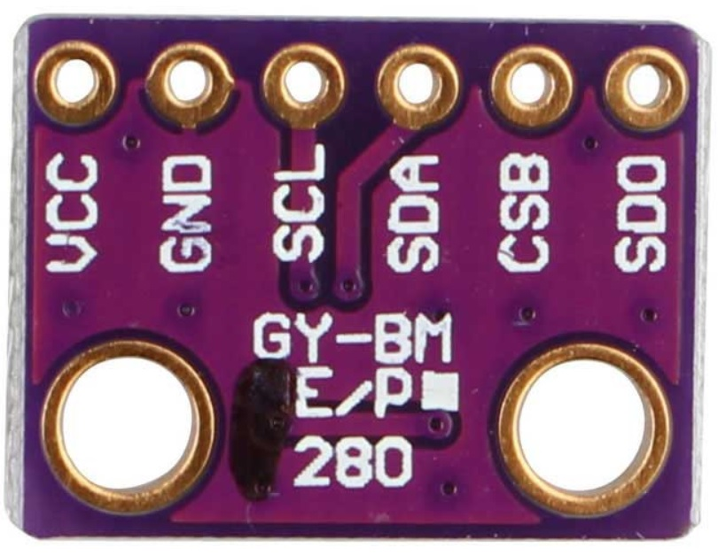
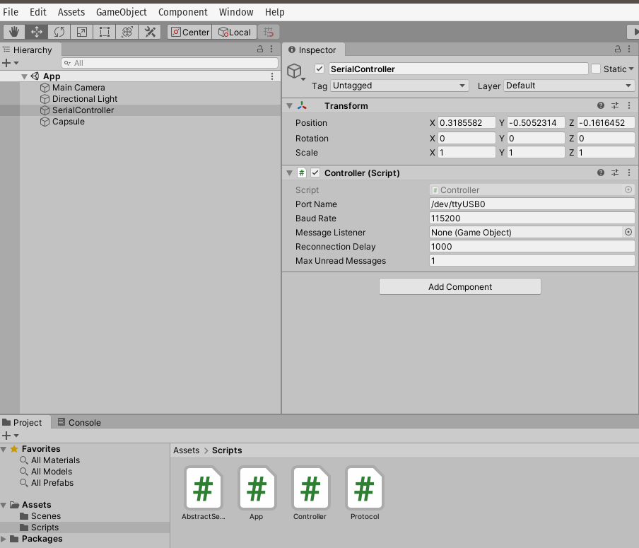
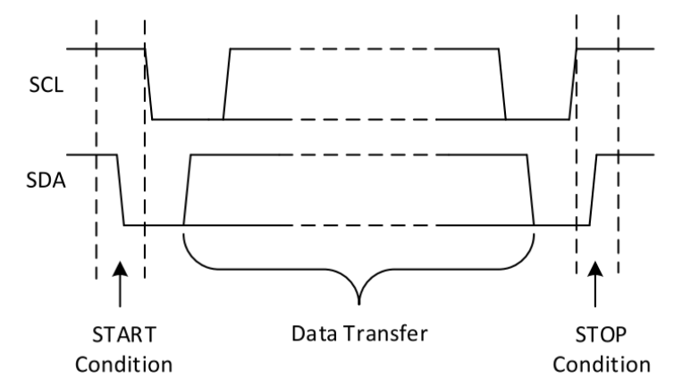
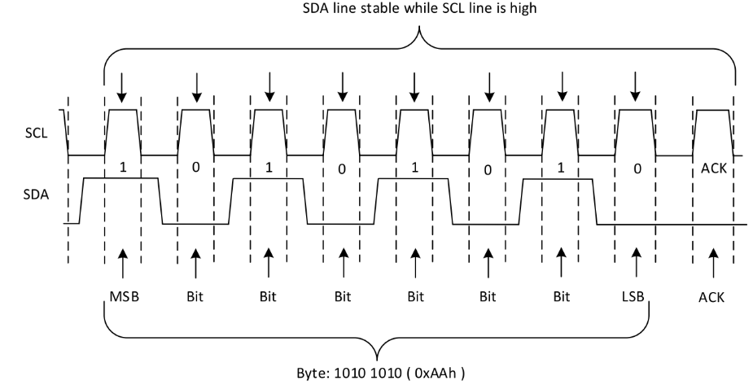
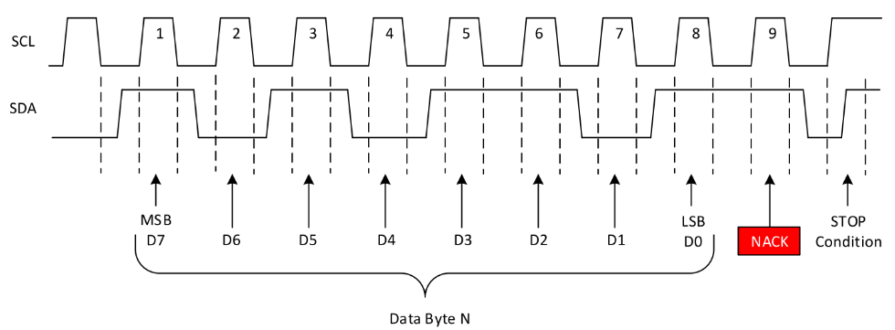
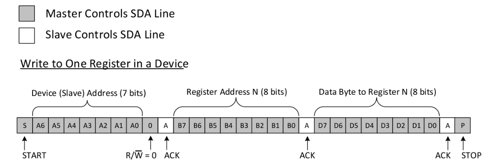
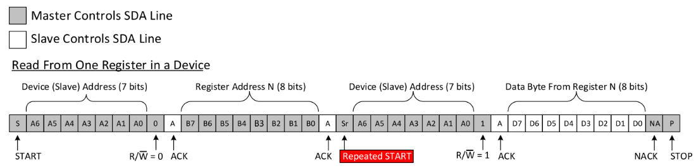
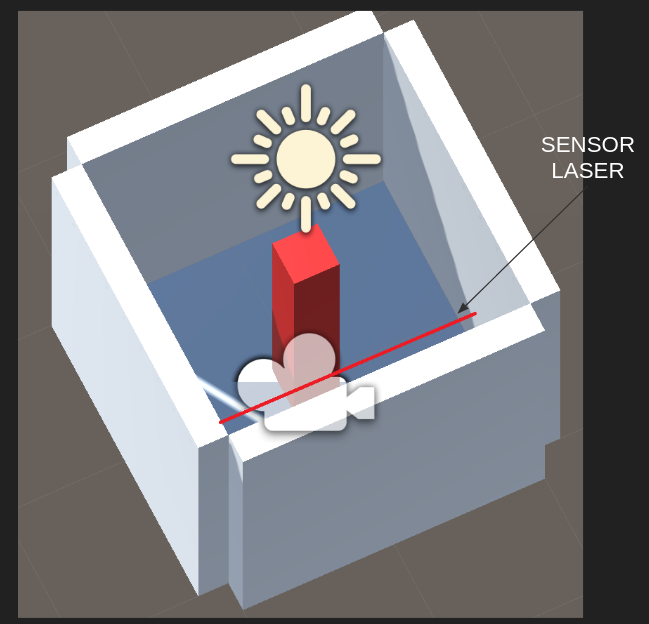

Unidad 2. proyecto de curso
==============================================

Introducción
--------------

Esta será la unidad dedicada al proyecto de curso. Lo 
que te dejará en la unidad es INFORMACIÓN que puedes 
utilizar o no para realizar el proyecto. Recuerda 
que tienes libertad completa para usar los recursos 
que desees.

Propósito de aprendizaje
**************************

Definir, Diseñar e implementar un proyecto que permita integrar 
sistemas de cómputo distribuidos para la construcción de aplicaciones 
interactivas.

Material de referencia
------------------------

Sensores y actuares I2C y SPI 
*******************************

Ejercicio 1
^^^^^^^^^^^^

Observa el `siguiente <https://youtu.be/IyGwvGzrqp8>`__ video donde verás una introducción 
a las comunicaciones seriales, por I2C y por SPI.

Ejercicio 2
^^^^^^^^^^^^

En `este <https://learn.sparkfun.com/tutorials/serial-peripheral-interface-spi/all>`__ 
vas a poder profundizar un poco más sobre SPI.

Ejercicio 3
^^^^^^^^^^^^

En base al material que leíste responde estas preguntas sobre el bus SPI:

* ¿Cómo se conectan físicamente dos dispositivos?
* ¿Qué debo hacer para conectar físicamente más de un sensor/actuador a un controlador?
* ¿Qué se envía primero, el byte de mayor peso o el de menor peso?
* ¿La señal de reloj descansa en alto o en bajo?
* ¿Los datos se muestrean en el flanco de subida o en el flanco de bajada del clock?
* ¿A qué velocidad se comunican dos dispositivos?
* ¿Debe existir algún retardo entre transmisiones?

Ejercicio 4
^^^^^^^^^^^^

Observa el siguiente fragmento de código típico
al utilizar el framework de arduino:

.. code-block:: cpp
   :lineno-start: 1

    SPI.transfer(0xCD);
    byte x = SPI.transfer (0x00);
  
¿El valor almacenado en x corresponde a la transferencia 0xCD o 0x00?

Ejercicio 5
^^^^^^^^^^^^

Ahora que ya entiendes cómo funciona el SPI, vamos a utilizar un sensor
llamado el BME280 que puedes comprar `aquí <https://www.didacticaselectronicas.com/index.php/sensores/presion-atm/sensor-de-presion-atmosferica-bmp280-sensores-de-presion-relativa-atmosferica-barometros-bmp180-detail>`__ 
El BME280 es un sensor ambiental que permite medir humedad relativa, presión y temperatura.
Como  controlador, vamos a utilizar el ESP32 y el `framework de arduino <https://github.com/espressif/arduino-esp32>`__.

Ten presente este material de referencia:

* API de `arduino <https://www.arduino.cc/en/Reference/SPI>`__.
* Código fuente del módulo SPI del `ESP32 Arduino Core <https://github.com/espressif/arduino-esp32/tree/master/libraries/SPI/src>`__.
* Información general del sensor `BME280 <https://www.bosch-sensortec.com/bst/products/all_products/bme280>`__.
* Hoja de datos del sensor `BME280 <https://ae-bst.resource.bosch.com/media/_tech/media/datasheets/BST-BME280-DS002.pdf>`__.
* Tutorial del sensor `BME280 <https://learn.adafruit.com/adafruit-bme280-humidity-barometric-pressure-temperature-sensor-breakout/overview>`__.

La siguiente figura te muestra un diagrama del sensor: 

Las señales tienen la siguiente función:

* VCC: alimentación a 3.3V.
* GND: 0V.
* SCL: Clock SPI.
* SDA: MOSI SPI.
* CSB: CS o SS (Chip Select) SPI.
* SDO: MISO SPI.

Los puertos del controlador los verás `aquí <https://github.com/espressif/arduino-esp32/raw/master/docs/esp32_pinmap.png>`__ 

Para conectar el sensor con el controlador se procede así:

========== ======== =======
DevKit32   BME280   SPI
========== ======== =======
3V3         VCC      ---
GND         GND      ---
SCK/18      SCL      CLOCK
MOSI/23     SDA      MOSI
SS/5/LED    CSB      SS
MISO/19     SDO      MISO 
========== ======== =======

Ejercicio 6
^^^^^^^^^^^^

En cuanto al software, necesitarás añadir las siguientes bibliotecas:

* `Adafruit Sensor <https://github.com/adafruit/Adafruit_Sensor>`__
* `Adafruit BME280 Library <https://github.com/adafruit/Adafruit_BME280_Library>`__

Ahora viene lo bueno. Vamos a probar que todo está bien conectado y que tienes
las bibliotecas instaladas. Abre uno de los ejemplos de la biblioteca 
Adafruit BME280 llamado BME280test.ino. 

Realiza las siguiente modificaciones:

Comenta el archivo de cabeceras Wire.h. Este archivo corresponde al API I2C (este
sensor soporta los dos protocolos, pero por ahora estamos con el SPI).

Modificar el pinout del SPI:

.. code-block:: c 
   :lineno-start: 24

    #include <SPI.h>
    #define BME_SCK 18
    #define BME_MISO 19
    #define BME_MOSI 23
    #define BME_CS 5

Comenta la línea que declara el objeto I2C y descomenta la
correspondiente a SPI:

.. code-block:: c 
   :lineno-start: 33

    //Adafruit_BME280 bme; // I2C
    Adafruit_BME280 bme(BME_CS); // hardware SPI
    //Adafruit_BME280 bme(BME_CS, BME_MOSI, BME_MISO, BME_SCK); // software SPI

Observa como queda el código completo:

.. code-block:: cpp
   :lineno-start: 1

    /***************************************************************************
    This is a library for the BME280 humidity, temperature & pressure sensor

    Designed specifically to work with the Adafruit BME280 Breakout
    ----> http://www.adafruit.com/products/2650

    These sensors use I2C or SPI to communicate, 2 or 4 pins are required
    to interface. The device's I2C address is either 0x76 or 0x77.

    Adafruit invests time and resources providing this open source code,
    please support Adafruit andopen-source hardware by purchasing products
    from Adafruit!

    Written by Limor Fried & Kevin Townsend for Adafruit Industries.
    BSD license, all text above must be included in any redistribution
    ***************************************************************************/

    //#include <Wire.h>

    #include <Adafruit_Sensor.h>
    #include <Adafruit_BME280.h>

    #include <SPI.h>
    #define BME_SCK 18
    #define BME_MISO 19
    #define BME_MOSI 23
    #define BME_CS 5

    #define SEALEVELPRESSURE_HPA (1013.25)

    //Adafruit_BME280 bme; // I2C
    Adafruit_BME280 bme(BME_CS); // hardware SPI
    //Adafruit_BME280 bme(BME_CS, BME_MOSI, BME_MISO, BME_SCK); // software SPI

    unsigned long delayTime;

    void setup() {
    Serial.begin(9600);
    Serial.println(F("BME280 test"));

    bool status;

    // default settings
    // (you can also pass in a Wire library object like &Wire2)
    //status = bme.begin(0x76);ç
    status = bme.begin();
    if (!status) {
        Serial.println("Could not find a valid BME280 sensor, check wiring!");
        while (1);
    }

    Serial.println("-- Default Test --");
    delayTime = 1000;

    Serial.println();
    }

    void loop() {
    printValues();
    delay(delayTime);
    }

    void printValues() {
    Serial.print("Temperature = ");
    Serial.print(bme.readTemperature());
    Serial.println(" *C");

    Serial.print("Pressure = ");

    Serial.print(bme.readPressure() / 100.0F);
    Serial.println(" hPa");

    Serial.print("Approx. Altitude = ");
    Serial.print(bme.readAltitude(SEALEVELPRESSURE_HPA));
    Serial.println(" m");

    Serial.print("Humidity = ");
    Serial.print(bme.readHumidity());
    Serial.println(" %");

    Serial.println();
    }

Una vez ejecutes el código este será el resultado::

    Temperature = 25.44 *C
    Pressure = 850.51 hPa
    Approx. Altitude = 1452.61 m
    Humidity = 51.67 %S

    Temperature = 25.43 *C
    Pressure = 850.43 hPa
    Approx. Altitude = 1453.42 m
    Humidity = 51.67 %

    Temperature = 25.43 *C
    Pressure = 850.47 hPa
    Approx. Altitude = 1453.03 m
    Humidity = 51.67 %

La temperatura se reporta como un número en punto flotante en
grados centígrados. La presión se reporta como un número en punto
flotante en Pascales. Nota que el valor de presión se divide por
el literal 100.0F (constante en punto flotante) para convertir
a hecto Pascales el resultado. Para el cálculo de la altitud
aproximada, es necesario pasar la presión sobre el nivel del mar
de la ciudad al día y hora de la prueba en unidades de hecto
Pascales. Finalmente, se reporta la humedad relativa en punto flotante.

Ejercicio 7
^^^^^^^^^^^^

Ahora te recomiendo que analices a fondo el código fuente de la biblioteca.
De hecho, este es uno de los mejores ejercicios para aprender a programar.

El código fuente lo encuentras `aquí <https://github.com/adafruit/Adafruit_BME280_Library/blob/master/Adafruit_BME280.cpp>`__ 

Piensa en estas preguntas:

* Analiza el código del constructor de la clase. ¿Qué estrategia
  utilizan para diferenciar el SPI por hardware al SPI por software?
* ¿En qué parte del código se inicializa el objeto SPI?
* Haciendo la lectura del código fuente, ¿Qué bit se envía primero,
  el de mayor peso o el de menor peso?
* ¿Cuál modo de SPI utiliza el sensor?
* ¿Cuál es la velocidad de comunicación?
* El sensor soporta dos modos SPI. Leyendo la información en la hoja
  de datos, cómo sería posible configurar el modo?
* ¿Cómo es el protocolo para escribir información en el sensor?
* ¿Cómo es el protocolo para leer información del sensor?
* Busque en el código fuente de la biblioteca,  ¿Dónde se lee
  el chip-ID del sensor BME280?
* Muestra y explica detalladamente los pasos y el código para identificar
  el chip-ID. No olvide apoyarse de la hoja de datos
* ¿Qué otros pasos se requieren para inicializar el sensor?

Ejercicio 8
^^^^^^^^^^^^

¿Qué hacer si quieres transmitir información del sensor a una plataforma
interactiva? Deberás decidir qué tipo de protocolo vas a usar: ASCII o binario.

¿Repasamos un poco?

Para transmitir información de variables usando un protocolo binario
necesitas obtener los bytes que componen una variable.

¿Cómo conseguir cada uno de los bytes que componen la variable?

Considera este código:

.. code-block:: cpp
    :linenos:

    void setup() {
      Serial.begin(115200);

    }

    void loop() {
      static uint16_t x = 0;

      if (Serial.available()) {
        if (Serial.read() == 0x73) {
          Serial.write((uint8_t)( x & 0x00FF ));
          Serial.write( (uint8_t)(x >> 8 ));
        }
      }
    }

Nota cómo la operación (x >> 8 ) permite conseguir el byte de mayor
peso del entero no signado de 16 bits x.

Abre el programa ScriptCommunicator e interactúa con la aplicación 
anterior:

* ¿Qué debo hacer para que el ESP32 me responda?
* ¿Qué significan los datos que estoy recibiendo?

* Ahora intentemos la misma técnica para conseguir los bytes de un número en
  punto flotante.

.. code-block:: cpp
    :linenos:

    void setup() {
        Serial.begin(115200);
    }

    void loop() {
        float num = 1.1;

        if (Serial.available()) {
            if (Serial.read() == 0x73) {
                Serial.write((uint8_t)( num ));
                Serial.write( (uint8_t)(num >> 8 ));
                Serial.write( (uint8_t)(num >> 16 ));
                Serial.write( (uint8_t)(num >> 32 ));
            }
        }
    }

El 1.1 en punto flotante será el 3f 8c cc cd

* ¿Pudiste compilar el programa?

Nota que al intentar compilar, el compilador te dirá que no es posible
aplicar el operador >> al tipo float.

* Debemos entonces aplicar una técnica diferente para obtener los bytes
  del float:

.. code-block:: cpp
    :linenos:

    void setup() {
        Serial.begin(115200);
    }

    void loop() {
        // 45 60 55 d5
        // https://www.h-schmidt.net/FloatConverter/IEEE754.html
        static float num = 3589.3645;
    
        static uint8_t arr[4] = {0};

        if(Serial.available()){
            if(Serial.read() == 0x73){
                memcpy(arr,(uint8_t *)&num,4);
                Serial.write(arr,4);
            }
        }
    }

En este caso estamos guardando los 4 bytes que componen el float
en un arreglo, arr, para luego transmitir dicho arreglo.

* ¿En qué orden estamos transmitiendo los bytes, en bigEndian o en
  littleEndian?

Ejercicio 9
^^^^^^^^^^^^

Ahora si, vamos a conectarnos a Unity, pero aún sin sensor. Veamos paso
a paso. Simularemos el sensor con un programa de prueba en el ESP32. 

Nuestro sensor simulado enviará tres números de 16 bits sin signo que modificarán
la escala x, y, z de un GameObject en Unity. Este envío solo lo realizará
cuando Unity solicite datos.

Unity solicitará los datos enviando el byte 0x73 y recibirá 6 bytes (2 por cada número) en 
little endian con los valores de la escala.

Implementa el siguiente código y analiza parte por parte:

El código del ESP32 simulando el sensor:

.. code-block:: cpp

    void setup() {
      Serial.begin(115200);

    }

    void loop() {
      static uint16_t x = 0;
      static uint16_t y = 0;
      static uint16_t z = 0;
      static bool countUp = true;

      if (Serial.available()) {
        if (Serial.read() == 0x73) {
          Serial.write((uint8_t)( x & 0x00FF));
          Serial.write( (uint8_t)( x >> 8 ));
          Serial.write((uint8_t)( y & 0x00FF ));
          Serial.write((uint8_t)(y >> 8 ));
          Serial.write((uint8_t)( z & 0x00FF ));
          Serial.write((uint8_t)(z >> 8 ));

          if (countUp == true) {
            if (x < 1000) {
              x = x + 1;
              y = y + 1;
              z = z + 1;
            }
            else countUp = false;
          }

          if (countUp == false)
          {
            if (x > 0) {
              x = x - 1;
              y = y - 1;
              z = z - 1;
            }
            else countUp = true;
          }
        }
      }
    }

Prueba este código con ScriptCommunicator antes de continuar.

El código de Unity tendrá la misma arquitectura de Ardity: un 
controlador, la implementación del protocolo y la aplicación como tal.

El código para el protocolo:

.. code-block:: csharp

    using System.Collections;
    using System.Collections.Generic;
    using UnityEngine;
    using System.IO.Ports;

    using System.Text;

    public class Protocol : AbstractSerialThread
    {
        // Buffer where a single message must fit
        private byte[] buffer = new byte[1024];
        private int bufferUsed = 0;

        public Protocol(string portName,
                                          int baudRate,
                                          int delayBeforeReconnecting,
                                          int maxUnreadMessages)
            : base(portName, baudRate, delayBeforeReconnecting, maxUnreadMessages, false)
        {

        }

        protected override void SendToWire(object message, SerialPort serialPort)
        {
            byte[] binaryMessage = (byte[])message;
            serialPort.Write(binaryMessage, 0, binaryMessage.Length);
        }

        protected override object ReadFromWire(SerialPort serialPort)
        {
            if(serialPort.BytesToRead >= 6)
            {
                
                bufferUsed = serialPort.Read(buffer, 0, 6);
                byte[] returnBuffer = new byte[bufferUsed];
                System.Array.Copy(buffer, returnBuffer, bufferUsed);
    /*
                StringBuilder sb = new StringBuilder();
                sb.Append("Packet: ");
                foreach (byte data in buffer)
                {
                    sb.Append(data.ToString("X2") + " ");
                }
                sb.Append("Checksum fails");
                Debug.Log(sb);
    */

                return returnBuffer;
            }
            else
            {
                return null;
            }
        }

    }

El código del controlador:

.. code-block:: csharp

    using System.Collections;
    using System.Collections.Generic;
    using UnityEngine;

    using System.Threading;

    public class Controller : MonoBehaviour
    {
        [Tooltip("Port name with which the SerialPort object will be created.")]
        public string portName = "/dev/ttyUSB0";

        [Tooltip("Baud rate that the serial device is using to transmit data.")]
        public int baudRate = 57600;

        [Tooltip("Reference to an scene object that will receive the events of connection, " +
                "disconnection and the messages from the serial device.")]
        public GameObject messageListener;

        [Tooltip("After an error in the serial communication, or an unsuccessful " +
                "connect, how many milliseconds we should wait.")]
        public int reconnectionDelay = 1000;

        [Tooltip("Maximum number of unread data messages in the queue. " +
                "New messages will be discarded.")]
        public int maxUnreadMessages = 1;

        // Internal reference to the Thread and the object that runs in it.
        protected Thread thread;
        protected Protocol serialThread;

        // ------------------------------------------------------------------------
        // Invoked whenever the SerialController gameobject is activated.
        // It creates a new thread that tries to connect to the serial device
        // and start reading from it.
        // ------------------------------------------------------------------------
        void OnEnable()
        {
            serialThread = new Protocol(portName,
                                                          baudRate,
                                                          reconnectionDelay,
                                                          maxUnreadMessages);
            thread = new Thread(new ThreadStart(serialThread.RunForever));
            thread.Start();
        }

        // ------------------------------------------------------------------------
        // Invoked whenever the SerialController gameobject is deactivated.
        // It stops and destroys the thread that was reading from the serial device.
        // ------------------------------------------------------------------------
        void OnDisable()
        {
            // If there is a user-defined tear-down function, execute it before
            // closing the underlying COM port.
            if (userDefinedTearDownFunction != null)
                userDefinedTearDownFunction();

            // The serialThread reference should never be null at this point,
            // unless an Exception happened in the OnEnable(), in which case I've
            // no idea what face Unity will make.
            if (serialThread != null)
            {
                serialThread.RequestStop();
                serialThread = null;
            }

            // This reference shouldn't be null at this point anyway.
            if (thread != null)
            {
                thread.Join();
                thread = null;
            }
        }

        // ------------------------------------------------------------------------
        // Polls messages from the queue that the SerialThread object keeps. Once a
        // message has been polled it is removed from the queue. There are some
        // special messages that mark the start/end of the communication with the
        // device.
        // ------------------------------------------------------------------------
        void Update()
        {
            // If the user prefers to poll the messages instead of receiving them
            // via SendMessage, then the message listener should be null.
            if (messageListener == null)
                return;

            // Read the next message from the queue
            byte[] message = ReadSerialMessage();
            if (message == null)
                return;

            // Check if the message is plain data or a connect/disconnect event.
            messageListener.SendMessage("OnMessageArrived", message);
        }

        // ------------------------------------------------------------------------
        // Returns a new unread message from the serial device. You only need to
        // call this if you don't provide a message listener.
        // ------------------------------------------------------------------------
        public byte[] ReadSerialMessage()
        {
            // Read the next message from the queue
            return (byte[]) serialThread.ReadMessage();
        }

        // ------------------------------------------------------------------------
        // Puts a message in the outgoing queue. The thread object will send the
        // message to the serial device when it considers it's appropriate.
        // ------------------------------------------------------------------------
        public void SendSerialMessage(byte[] message)
        {
            serialThread.SendMessage(message);
        }

        // ------------------------------------------------------------------------
        // Executes a user-defined function before Unity closes the COM port, so
        // the user can send some tear-down message to the hardware reliably.
        // ------------------------------------------------------------------------
        public delegate void TearDownFunction();
        private TearDownFunction userDefinedTearDownFunction;
        public void SetTearDownFunction(TearDownFunction userFunction)
        {
            this.userDefinedTearDownFunction = userFunction;
        }

    }

El código de la clase AbstractSerialThread

.. code-block:: csharp

    /**
    * Ardity (Serial Communication for Arduino + Unity)
    * Author: Daniel Wilches <dwilches@gmail.com>
    *
    * This work is released under the Creative Commons Attributions license.
    * https://creativecommons.org/licenses/by/2.0/
    */

    using UnityEngine;

    using System;
    using System.IO;
    using System.IO.Ports;
    using System.Collections;
    using System.Threading;

    /**
    * This class contains methods that must be run from inside a thread and others
    * that must be invoked from Unity. Both types of methods are clearly marked in
    * the code, although you, the final user of this library, don't need to even
    * open this file unless you are introducing incompatibilities for upcoming
    * versions.
    */
    public abstract class AbstractSerialThread
    {
        // Parameters passed from SerialController, used for connecting to the
        // serial device as explained in the SerialController documentation.
        private string portName;
        private int baudRate;
        private int delayBeforeReconnecting;
        private int maxUnreadMessages;

        // Object from the .Net framework used to communicate with serial devices.
        private SerialPort serialPort;

        // Amount of milliseconds alloted to a single read or connect. An
        // exception is thrown when such operations take more than this time
        // to complete.
        private const int readTimeout = 100;

        // Amount of milliseconds alloted to a single write. An exception is thrown
        // when such operations take more than this time to complete.
        private const int writeTimeout = 100;

        // Internal synchronized queues used to send and receive messages from the
        // serial device. They serve as the point of communication between the
        // Unity thread and the SerialComm thread.
        private Queue inputQueue, outputQueue;

        // Indicates when this thread should stop executing. When SerialController
        // invokes 'RequestStop()' this variable is set.
        private bool stopRequested = false;

        private bool enqueueStatusMessages = false;

        /**************************************************************************
        * Methods intended to be invoked from the Unity thread.
        *************************************************************************/

        // ------------------------------------------------------------------------
        // Constructs the thread object. This object is not a thread actually, but
        // its method 'RunForever' can later be used to create a real Thread.
        // ------------------------------------------------------------------------
        public AbstractSerialThread(string portName,
                                    int baudRate,
                                    int delayBeforeReconnecting,
                                    int maxUnreadMessages,
                                    bool enqueueStatusMessages)
        {
            this.portName = portName;
            this.baudRate = baudRate;
            this.delayBeforeReconnecting = delayBeforeReconnecting;
            this.maxUnreadMessages = maxUnreadMessages;
            this.enqueueStatusMessages = enqueueStatusMessages;

            inputQueue = Queue.Synchronized(new Queue());
            outputQueue = Queue.Synchronized(new Queue());
        }

        // ------------------------------------------------------------------------
        // Invoked to indicate to this thread object that it should stop.
        // ------------------------------------------------------------------------
        public void RequestStop()
        {
            lock (this)
            {
                stopRequested = true;
            }
        }

        // ------------------------------------------------------------------------
        // Polls the internal message queue returning the next available message
        // in a generic form. This can be invoked by subclasses to change the
        // type of the returned object.
        // It returns null if no message has arrived since the latest invocation.
        // ------------------------------------------------------------------------
        public object ReadMessage()
        {
            if (inputQueue.Count == 0)
                return null;

            return inputQueue.Dequeue();
        }

        // ------------------------------------------------------------------------
        // Schedules a message to be sent. It writes the message to the
        // output queue, later the method 'RunOnce' reads this queue and sends
        // the message to the serial device.
        // ------------------------------------------------------------------------
        public void SendMessage(object message)
        {
            outputQueue.Enqueue(message);
        }

        /**************************************************************************
        * Methods intended to be invoked from the SerialComm thread (the one
        * created by the SerialController).
        *************************************************************************/

        // ------------------------------------------------------------------------
        // Enters an almost infinite loop of attempting connection to the serial
        // device, reading messages and sending messages. This loop can be stopped
        // by invoking 'RequestStop'.
        // ------------------------------------------------------------------------
        public void RunForever()
        {
            // This 'try' is for having a log message in case of an unexpected
            // exception.
            try
            {
                while (!IsStopRequested())
                {
                    try
                    {
                        AttemptConnection();

                        // Enter the semi-infinite loop of reading/writing to the
                        // device.
                        while (!IsStopRequested())
                            RunOnce();
                    }
                    catch (Exception ioe)
                    {
                        // A disconnection happened, or there was a problem
                        // reading/writing to the device. Log the detailed message
                        // to the console and notify the listener.
                        Debug.LogWarning("Exception: " + ioe.Message + " StackTrace: " + ioe.StackTrace);
                        if (enqueueStatusMessages)
                            inputQueue.Enqueue("__Disconnected__");

                        // As I don't know in which stage the SerialPort threw the
                        // exception I call this method that is very safe in
                        // disregard of the port's status
                        CloseDevice();

                        // Don't attempt to reconnect just yet, wait some
                        // user-defined time. It is OK to sleep here as this is not
                        // Unity's thread, this doesn't affect frame-rate
                        // throughput.
                        Thread.Sleep(delayBeforeReconnecting);
                    }
                }

                // Before closing the COM port, give the opportunity for all messages
                // from the output queue to reach the other endpoint.
                while (outputQueue.Count != 0)
                {
                    SendToWire(outputQueue.Dequeue(), serialPort);
                }

                // Attempt to do a final cleanup. This method doesn't fail even if
                // the port is in an invalid status.
                CloseDevice();
            }
            catch (Exception e)
            {
                Debug.LogError("Unknown exception: " + e.Message + " " + e.StackTrace);
            }
        }

        // ------------------------------------------------------------------------
        // Try to connect to the serial device. May throw IO exceptions.
        // ------------------------------------------------------------------------
        private void AttemptConnection()
        {

            Debug.Log("Openening the serial port");
            serialPort = new SerialPort(portName, baudRate);
            serialPort.ReadTimeout = readTimeout;
            serialPort.WriteTimeout = writeTimeout;
            serialPort.DtrEnable = true;
            serialPort.Open();

            if (enqueueStatusMessages)
                inputQueue.Enqueue("__Connected__");
        }

        // ------------------------------------------------------------------------
        // Release any resource used, and don't fail in the attempt.
        // ------------------------------------------------------------------------
        private void CloseDevice()
        {
            if (serialPort == null)
                return;

            try
            {
                serialPort.Close();
            }
            catch (IOException)
            {
                // Nothing to do, not a big deal, don't try to cleanup any further.
            }

            serialPort = null;
        }

        // ------------------------------------------------------------------------
        // Just checks if 'RequestStop()' has already been called in this object.
        // ------------------------------------------------------------------------
        private bool IsStopRequested()
        {
            lock (this)
            {
                return stopRequested;
            }
        }

        // ------------------------------------------------------------------------
        // A single iteration of the semi-infinite loop. Attempt to read/write to
        // the serial device. If there are more lines in the queue than we may have
        // at a given time, then the newly read lines will be discarded. This is a
        // protection mechanism when the port is faster than the Unity progeram.
        // If not, we may run out of memory if the queue really fills.
        // ------------------------------------------------------------------------
        private void RunOnce()
        {
            try
            {
                // Send a message.
                if (outputQueue.Count != 0)
                {
                    SendToWire(outputQueue.Dequeue(), serialPort);
                }

                // Read a message.
                // If a line was read, and we have not filled our queue, enqueue
                // this line so it eventually reaches the Message Listener.
                // Otherwise, discard the line.
                object inputMessage = ReadFromWire(serialPort);
                if (inputMessage != null)
                {
                    if (inputQueue.Count < maxUnreadMessages)
                    {
                        inputQueue.Enqueue(inputMessage);
                    }
                    else
                    {
                        Debug.LogWarning("Queue is full. Dropping message: " + inputMessage);
                    }
                }
            }
            catch (TimeoutException)
            {
                // This is normal, not everytime we have a report from the serial device
            }
        }

        // ------------------------------------------------------------------------
        // Sends a message through the serialPort.
        // ------------------------------------------------------------------------
        protected abstract void SendToWire(object message, SerialPort serialPort);

        // ------------------------------------------------------------------------
        // Reads and returns a message from the serial port.
        // ------------------------------------------------------------------------
        protected abstract object ReadFromWire(SerialPort serialPort);
    }

Finalmente el código de la aplicación

.. code-block:: csharp

    using System.Collections;
    using System.Collections.Generic;
    using UnityEngine;
    using System.Text;

    public class App : MonoBehaviour
    {
        public Controller serialController;
        private float timer = 0.0f;
        private float waitTime = 0.005f;

        private Transform objTransform;
        private Vector3 scaleChange;

        // Initialization
        void Start()
        {
            serialController = GameObject.Find("SerialController").GetComponent<Controller>();
            objTransform = GetComponent<Transform>();
            scaleChange = new Vector3(0f, 0f, 0f);
        }

        // Executed each frame
        void Update()
        {

          //---------------------------------------------------------------------
            // Send data
            //---------------------------------------------------------------------
            if (Input.GetKeyUp(KeyCode.Q))
            {
                //Debug.Log("Get data 0x73 ");
                serialController.SendSerialMessage(new byte[] { 0x73});
            }

            timer += Time.deltaTime;
            if (timer > waitTime)
            {
                timer = timer - waitTime;

                serialController.SendSerialMessage(new byte[] { 0x73});
            }

            //---------------------------------------------------------------------
            // Receive data
            //---------------------------------------------------------------------

            byte[] message = serialController.ReadSerialMessage();

            if (message == null)
                return;

            float x = ((float)System.BitConverter.ToUInt16(message, 0) ) / 500F;
            float y = ((float)System.BitConverter.ToUInt16(message, 2) ) / 500F;
            float z = ((float)System.BitConverter.ToUInt16(message, 4) ) / 500F;
            scaleChange.Set(x,y,z);

            objTransform.localScale =  scaleChange;

    /*         StringBuilder sb = new StringBuilder();
            sb.Append("Packet: ");
            foreach (byte data in message)
            {
                sb.Append(data.ToString("X2") + " ");
            }
            Debug.Log(sb); */
        }
    }

La configuración del proyecto queda como se muestra en la figura:

Ejercicio 10
^^^^^^^^^^^^^

Ahora le toca el turno a un sensor I2C. Observa de nuevo
`este <https://youtu.be/IyGwvGzrqp8>`__ video. Luego profundiza un poco más
`aquí <https://learn.sparkfun.com/tutorials/i2c/all>`__.

Ejercicio 11
^^^^^^^^^^^^^

En base al material que leíste responde estas preguntas sobre el bus I2C:

* ¿Cómo se conectan físicamente dos dispositivos?
* ¿Qué debo hacer para conectar físicamente más de un sensor/actuador a un controlador?
* ¿Cómo sabemos si tenemos un dispositivo particular en el bus?
* ¿Para qué sirven las resistencias de pullup?
* ¿Cómo se transmite un CERO en I2C?
* ¿Cómo se transmite un UNO en I2C?
* ¿Puede un esclavo enviar datos sin que un maestro lo solicite?
* ¿Puedo tener dos sensores iguales en el mismo bus I2C?
* ¿Qué y cómo es un ACK en I2C?
* ¿Qué y cómo es un NACK en I2C?

Ejercicio 12
^^^^^^^^^^^^^

¿Qué debe hacer un maestro para acceder un esclavo?

* La transferencia de datos únicamente es posible cuando el bus esté 
  IDLE (SDA y SCL están en alto luego de una condición de STOP). 

* Si el maestro quiere enviar datos al esclavo:
  
  * El maestro-tx envía la condición de START y direcciona al esclavo-rx
  * El maestro-tx envía datos al esclavo-rx
  * El maestro-tx termina la comunicación enviando la condición de STOP.

* Si el maestro quiere recibir datos del esclavo:
  
  * El maestro-rx envía la condición de START y direcciona al esclavo-tx
  * El maestro-rx envía una petición del registro que desea leer del esclavo-tx
  * El maestro-rx recibe los datos del esclavo-tx
  * El maestro-rx termina la transferencia con una condición de STOP.

Ejercicio 13
^^^^^^^^^^^^^

¿Qué cosas pueden generar un NACK?

* El receptor genera un NACK porque no puede enviar o transmitir información
  porque no está listo. Posiblemente esté procesando algo.
* El receptor no entendió el byte que le transmitieron
* El receptor no puede recibir más datos.
* Un Master-rx le indica a un esclavo que ya terminó de recibir datos mediante un NACK.

Ejercicio 14
^^^^^^^^^^^^^

Considera estas dos figuras:

Al transferir datos ¿Por qué la señal de SDA debe estar 
estable mientras SCL está en alto?

Ejercicio 14
^^^^^^^^^^^^^

En la siguiente figura podrás ver un ejemplo de un Nack:

¿Cómo sería en este caso un ACK?

Ejercicio 15
^^^^^^^^^^^^^

Observa la siguiente figura:

En este caso vemos que un maestro está escribiendo un esclavo.

Analicemos cada uno de los pasos que observamos en el diagrama:

#. El maestro direcciona al esclavo. Como el esclavo si está presente
   responde con un ACK. Adicionalmente el maestro le está indicando
   al esclavo que va a escribir un dato (R/W)
#. El maestro envía un dato y el esclavo responde con un ACK. El dato
   enviado corresponde a la dirección de un registro interno del
   esclavo que el maestro quiere escribir.
#. Finalmente, el maestro envía el datos a escribir en el registro. El
   esclavo responde con ACK.
#. El maestro envía la condición de parada.

Ejercicio 16
^^^^^^^^^^^^^

Observa la siguiente figura:

En este caso vemos que un maestro está leyendo dato del esclavo.

Analicemos cada uno de los pasos que observamos en el diagrama:

#. El maestro direcciona al esclavo. Como el esclavo si está en el
   bus responde con ACK. El maestro indica además que va a escribir
   al esclavo. ¿QUÉ? ¿No lo iba a leer pues? Si, lo que desea hacer
   el maestro es leer un REGISTRO interno del esclavo, pero primero
   debe decirle al esclavo qué registro va a leer.
#. El maestro escribe la dirección del registro a leer y el esclavo
   envía un ACK.
#. El maestro envía de nuevo una condición de ARRANQUE, pero
   al no enviar previamente la condición de parada se marca como un SR
   o repeated START. El maestro hace esto para indicarle al esclavo
   que ahora lo va a leer. Nota que el esclavo manda el ACK.
#. Luego el esclavo devuelve el dato almacenado en el registro que
   el maestro deseaba leer.
#. El maestro le responde al esclavo con un NACK y luego una condición
   de parada indicando de esta manera que ya tiene el dato y que se
   termina la transacción en el bus.
   
Ejercicio 17: RETO
^^^^^^^^^^^^^^^^^^^^
Ahora vamos a practicar todo lo anterior conectando el ESP32 a un sensor I2C. En este caso 
será `este <https://www.didacticaselectronicas.com/index.php/semiconductores/reloj-de-tiempo-real/shield-ds1307-rtc-para-wemos-d1-mini-wemos-sh-rtc-reloj-tiempo-real-relojes-de-tiempo-real-rtcs-wemos-detail>`__ 
reloj de tiempo real.

`Aquí <https://datasheets.maximintegrated.com/en/ds/DS1307.pdf>`__ 
está la hoja de datos del dispositivo.

La biblioteca de arduino es `esta <https://www.arduino.cc/en/Reference/Wire>`__.

Los planos del sensor está `aquí <http://robotdyn.com/pub/media/0G-00005695==D1mini-SHLD-RTCDS1307/DOCS/Schematic==0G-00005695==D1mini-SHLD-RTCDS1307.pdf>`__ 

Para conectar el ESP32 con el sensor usa la siguiente tabla:

========== ======== =======
DevKit32   DS1307   I2C
========== ======== =======
5V          5V       ---
3V          3V3      ---
GND         GND      ---
22          D1       SCL
21          D2       SDA 
========== ======== =======

.. note:: SOBRE LAS RESISTENCIAS DE PULL UP

    Nota que no estamos usando resistencias de pull up al conectar 
    el ESP32 con el DS1307. La razón es que el módulo que te recomendé 
    ya tiene las resistencias.

Ejercicio 18: RETO
^^^^^^^^^^^^^^^^^^^^

¿Cómo probamos si los dispositivos quedaron bien conectados?

Debes hacer un programa en el controlador que detecte si el dispositivo
está o no en el bus I2C. ¿Recuerdas las figuras con los diagramas de tiempo?
¿Qué era lo primero que hacía el maestro cuando deseaba leer o escribir?
Si el esclavo está en el bus ¿Qué le responde al maestro?

Ejercicio 19: RETO
^^^^^^^^^^^^^^^^^^^^

Construye una aplicación para el ESP32 que:

* Detecte si el sensor está en el bus I2C.
* Detecte si el sensor se desconecta del bus.
* Configura la hora, minutos, segundos y el formato 12H o 24H.
* Configura el día, mes, año y día de la semana.
* Lee la hora completa (horas, minutos, segundos).
* Lee la fecha completa (día, mes, año y día de la semana).

Puedes utilizar el programa monitor de arduino para verificar
todas las características anteriores.

Ejercicio 20: RETO
^^^^^^^^^^^^^^^^^^^^

Construye una biblioteca para Arduino con todo lo que aprendiste.
Te puedes basar en `esta <https://www.arduino.cc/en/Hacking/libraryTutorial>`__ 
referencia para construir tu propia biblioteca.

Sensores y actuadores inalámbricos
***************************************

Estos ejercicios te permitirán aprender cómo conectar 
sensores y actuadores a una aplicación mediante protocolos
de comunicación inalámbricos en una red WiFi.

Ejercicio 1
^^^^^^^^^^^^

Con este ejercicio aprenderás a conectar un sensor/actuador a una red 
WiFi y a comunicar esos dispositivos mediante el protocolo TCP.

Inicia trabajando con `esta <https://docs.google.com/presentation/d/1BBIfX3Tbd6zcDdDVLyjm4PxiaBu9PbsWwRsxYX--lqY/edit?usp=sharing>`__ 
guía.

Ejercicio 2
^^^^^^^^^^^^

Ahora vamos a explorar `UDP <https://www.arduino.cc/en/Reference/WiFi>`__ mediante
el análisis de un proyecto simple que ilustra el uso del protocolo. 

Se trata de un conjunto de actuadores distribuidos en el espacio y un coordinar central, un PC.
Cada actuador enciende y apaga un puerto de entrada salida según lo indique el comando 
que recibido por UDP. Dicho comando será enviado por el coordinador central. 
El coordinador cuenta con un dispositivo, que llamaremos bridge, quien recibirá por serial los 
comandos y los reenvía por UDP a los actuadores distribuidos.

El protocolo de comunicación serial es simple. Se trata de un protocolo ascii compuesto por 
tres caracteres. El primer carácter indica a cual actuador se enviará el comando. 
El segundo carácter el estado deseado para la salida ('1' on, '0' off). Por último, 
se envía un carácter de sincronización ('*').

El código del bridge (el que recibe los comandos por serial y envía por WiFi) es el siguiente:

.. code-block:: cpp
   
   #include <WiFi.h>
   #include <WiFiUdp.h>
   
   const char* ssid = "?";
   const char* password = "?";
   WiFiUDP udpDevice;
   uint16_t localUdpPort = ?;
   uint16_t UDPPort = ?;
   #define MAX_LEDSERVERS 3
   const char* hosts[MAX_LEDSERVERS] = {"?.?.?.?", "?.?.?.?", "?.?.?.?"};
   #define SERIALMESSAGESIZE 3
   uint32_t previousMillis = 0;
   #define ALIVE 1000
   #define D0 5
   
   void setup() {
     pinMode(D0, OUTPUT);     // Initialize the LED_BUILTIN pin as an output
     digitalWrite(D0, HIGH);
     Serial.begin(115200);
     Serial.println();
     Serial.println();
     Serial.print("Connecting to ");
     Serial.println(ssid);
   
     WiFi.mode(WIFI_STA);
     WiFi.begin(ssid, password);
   
     while (WiFi.status() != WL_CONNECTED) {
       delay(500);
       Serial.print(".");
     }
     Serial.println("");
     Serial.println("WiFi connected");
     // Print the IP address
     Serial.println(WiFi.localIP());
     udpDevice.begin(localUdpPort);
   }
   
   void networkTask() {
     uint8_t LEDServer = 0;
     uint8_t LEDValue = 0;
     uint8_t syncChar;
   
     // Serial event:
     if (Serial.available() >= SERIALMESSAGESIZE) {
       LEDServer = Serial.read() - '0';
       LEDValue = Serial.read();
       syncChar = Serial.read();
       if ((LEDServer == 0) || (LEDServer > 3)) {
         Serial.println("Servidor inválido (seleccione 1,2,3)");
         return;
       }
       if (syncChar == '*') {
         udpDevice.beginPacket(hosts[LEDServer - 1] , UDPPort);
         udpDevice.write(LEDValue);
         udpDevice.endPacket();
       }
     }
     // UDP event:
     uint8_t packetSize = udpDevice.parsePacket();
     if (packetSize) {
       Serial.print("Data from: ");
       Serial.print(udpDevice.remoteIP());
       Serial.print(":");
       Serial.print(udpDevice.remotePort());
       Serial.print(' ');
       for (uint8_t i = 0; i < packetSize; i++) {
         Serial.write(udpDevice.read());
       }
     }
   }
   
   void aliveTask() {
     uint32_t currentMillis;
     static uint8_t ledState = 0;
     currentMillis  = millis();
     if ((currentMillis - previousMillis) >= ALIVE) {
       previousMillis = currentMillis;
       if (ledState == 0) {
         digitalWrite(D0, HIGH);
         ledState = 1;
       }
       else {
         digitalWrite(D0, LOW);
         ledState = 0;
       }
     }
   }
   
   void loop() {
     networkTask();
     aliveTask();
   }

Nota que a diferencia de TCP/IP, con UDP no es necesario establecer una conexión. Los pasos 
necesario para enviar datos por UDP serán:

* Crear un objeto WiFiUDP
* Iniciar el objeto estableciendo un socket compuesto por la dirección IP y el puerto de escucha.
* Iniciar la construcción del paquete a transmitir con beginPacket(), 
* Popular el buffer de transmisión con write.
* Enviar el paquete con endPacket().

El código de los actuadores distribuidos será:

.. code-block:: cpp

    #include <WiFi.h>
    #include <WiFiUdp.h>

    const char* ssid = "?";
    const char* password = "?";
    WiFiUDP udpDevice;
    uint16_t localUdpPort = ?;
    uint32_t previousMillis = 0;
    #define ALIVE 1000
    #define D0 5
    #define D8 18

    void setup() {
        pinMode(D0, OUTPUT);     // Initialize the LED_BUILTIN pin as an output
        digitalWrite(D0, HIGH);
        pinMode(D8, OUTPUT);     
        digitalWrite(D8, LOW);
        Serial.begin(115200);
        Serial.println();
        Serial.println();
        Serial.print("Connecting to ");
        Serial.println(ssid);

        WiFi.mode(WIFI_STA);
        WiFi.begin(ssid, password);

        while (WiFi.status() != WL_CONNECTED) {
            delay(500);
            Serial.print(".");
        }
        Serial.println("");
        Serial.println("WiFi connected");
        // Print the IP address
        Serial.println(WiFi.localIP());
        udpDevice.begin(localUdpPort);
    }

    void networkTask() {
        uint8_t data;
        uint8_t packetSize = udpDevice.parsePacket();
        if (packetSize) {
            data = udpDevice.read();
            if (data == '1') {
                digitalWrite(D0, HIGH);
            } else if (data == '0') {
                digitalWrite(D0, LOW);
            }
            // send back a reply, to the IP address and port we got the packet from
            udpDevice.beginPacket(udpDevice.remoteIP(), udpDevice.remotePort());
            udpDevice.write('1');
            udpDevice .endPacket();
        }
    }

    void aliveTask() {
        uint32_t currentMillis;
        static uint8_t ledState = 0;
        currentMillis  = millis();
        if ((currentMillis - previousMillis) >= ALIVE) {
            previousMillis = currentMillis;
            if (ledState == 0) digitalWrite(D8, HIGH);
            else digitalWrite(D8, LOW);
        }
    }

    void loop() {
        networkTask();
        aliveTask();
    }

Los pasos para recibir datos por UDP son:

* Crear un objeto WiFiUDP
* Iniciar el objeto estableciendo un socket compuesto por la dirección IP y el puerto de escucha.
* Procesar el siguiente paquete UDP con parsePacket(). Esta acción devolverá el tamaño 
  del paquete en bytes.
* Luego de llamar parsePacket() será posible utilizar los métodos read() y available().
* Leer el paquete.

En el ejemplo mostrado, nota que un actuador distribuido responderá al bridge con el carácter 
'1' cada que reciba un paquete. De esta manera el bridge sabrá que el dato llegó a su destino.

Ejercicio 3: despliegue del ejercicio
^^^^^^^^^^^^^^^^^^^^^^^^^^^^^^^^^^^^^^

Para desplegar este ejercicio necesitaras varios dispositivos: PC y dos ESP32. Puedes
usar un ESP32 para implementar el bridge y otro para implementar un actuador. Así mismo
puedes emplear el PC como coordinador y como uno o varios actuadores virtuales. También
podrías emplear el celular para simular un actuador.

Para desplegar el ejercicio es necesario identificar claramente las direcciones IP de cada 
uno de los actuadores remotos.

Utiliza un ESP32 para cada actuador y un ESP32 para el bridge. Si no cuentas con todos
los dispositivos, entonces puedes:

* Usar el ESP32 como bridge y como actuadores el celular y el computador.
* Utiliza los programas Hercules o ScriptCommunicator para simular la aplicación del PC y los actuadores.

Ejercicio 4: integración con Unity
^^^^^^^^^^^^^^^^^^^^^^^^^^^^^^^^^^^^^

Observa `este <https://youtu.be/cML814JD09g>`__ video. Vamos a analizar cómo podríamos
hacer para realizar una aplicación similar que utilice realidad virtual, pero que integre
dispositivos físicos en un ambiente real.

La aplicación se desplegará en un cuarto cuadrado que modelaremos como muestra la figura:

Recuerda, tenemos un espacio físico y su respectivo modelo virtual. Por tanto, si tocas
las paredes virtuales, sentirás las mismas paredes en el mundo físico.

Nota que en el centro hay un tótem que cambiará de color si el usuario es detectado
por un sensor laser.

El sensor laser y la aplicación VR están conectados por medio de una red WiFi utilizando
sockets UDP.

Si el sensor láser se activa se enviará el mensaje: ``sensor  2`` y el material del tótem
cambiará de rojo a negro. ``sensor  1`` hará que el color vuelva a rojo.

Como el protocolo de comunicación es UDP, buscamos 
en la `documentación <https://docs.microsoft.com/en-us/dotnet/api/system.net.sockets.udpclient.receive?view=net-5.0>`__ 
de C#. Allí incluso encontramos un ejemplo:

.. code-block:: csharp

    //Creates a UdpClient for reading incoming data.
    UdpClient receivingUdpClient = new UdpClient(11000);

    //Creates an IPEndPoint to record the IP Address and port number of the sender.
    // The IPEndPoint will allow you to read datagrams sent from any source.
    IPEndPoint RemoteIpEndPoint = new IPEndPoint(IPAddress.Any, 0);
    try{

        // Blocks until a message returns on this socket from a remote host.
        Byte[] receiveBytes = receivingUdpClient.Receive(ref RemoteIpEndPoint);

        string returnData = Encoding.ASCII.GetString(receiveBytes);

        Console.WriteLine("This is the message you received " +
                                returnData.ToString());
        Console.WriteLine("This message was sent from " +
                                    RemoteIpEndPoint.Address.ToString() +
                                    " on their port number " +
                                    RemoteIpEndPoint.Port.ToString());
    }
    catch ( Exception e ){
        Console.WriteLine(e.ToString());
    }

Pero más abajo leemos:

The Receive method will block until a datagram arrives from a remote host. 
When data is available, the Receive method will read the first enqueued 
datagram and return the data portion as a byte array. This method populates the 
remoteEP parameter with the IPAddress and port number of the sender.

Como ya sabemos esto hace que tengamos que usar un HILO para realizar la comunicación, 
de lo contrario nuestra aplicación interactiva estaría bloqueada mientras se
espera por la llegada de datos.

No hay problema. Ya sabemos cómo usar hilos cuando estudiamos Ardity. Este podría
ser entonces el código de nuestro hilo:

.. code-block:: csharp

    private void ReceiveDataListener()
    {
        while (true)
        {
            try
            {
                byte[] data = receiveClient.Receive(ref receiveEndPoint);
                string text = Encoding.UTF8.GetString(data);
                SerializeMessage(text);
            }
            catch (System.Exception ex)
            {
                Debug.Log(ex.ToString());
            }
        }
    }

No olvides, que no podemos acceder la API de Unity desde un hilo diferente al GameLoop. 
¿Entonces qué hacemos? Ya sabes: COLAS, como hicimos al estudiar Ardity.

.. code-block:: csharp

    private void SerializeMessage(string message)
    {
        try
        {
            string[] chain = message.Split(' ');
            string key = chain[0];
            float value = 0;
            if (float.TryParse(chain[1], out value))
            {
                receiveQueue.Enqueue(value);
            }
        }
        catch (System.Exception e)
        {
            Debug.Log(e.ToString());
        }
    }

Y cómo quedaría entonces la aplicación:

.. code-block:: csharp

    void Update()
    {
        if (receiveQueue.Count != 0)
        {
            float counter = (float)receiveQueue.Dequeue();

            if(counter == 1F) m_Material.color = Color.black;
            if(counter == 2F) m_Material.color = Color.red;
        }

    }

Ejercicio 5: RETO
^^^^^^^^^^^^^^^^^^^

Analiza con detenimiento el siguiente ejemplo. Te recomiendo que lo implementes
utilizando un computador y un ESP32:

.. code-block:: csharp

    using System.Collections;
    using System.Collections.Generic;
    using System.Net;
    using System.Net.Sockets;
    using System.Text;
    using System.Threading;
    using UnityEngine;

    public class comm : MonoBehaviour
    {

        private static comm instance;
        private Thread receiveThread;
        private UdpClient receiveClient;
        private IPEndPoint receiveEndPoint;
        public string ip = "127.0.0.1";
        public int receivePort = 32002;
        private bool isInitialized;
        private Queue receiveQueue;
        public GameObject cube;
        private Material m_Material;

        private void Awake()
        {
            Initialize();
        }

        private void Start()
        {
            m_Material = cube.GetComponent<Renderer>().material;
        }

        private void Initialize()
        {
            instance = this;
            receiveEndPoint = new IPEndPoint(IPAddress.Parse(ip), receivePort);
            receiveClient = new UdpClient(receivePort);
            receiveQueue = Queue.Synchronized(new Queue());
            receiveThread = new Thread(new ThreadStart(ReceiveDataListener));
            receiveThread.IsBackground = true;
            receiveThread.Start();
            isInitialized = true;
        }

        private void ReceiveDataListener()
        {
            while (true)
            {
                try
                {
                    byte[] data = receiveClient.Receive(ref receiveEndPoint);
                    string text = Encoding.UTF8.GetString(data);
                    SerializeMessage(text);
                }
                catch (System.Exception ex)
                {
                    Debug.Log(ex.ToString());
                }
            }
        }

        private void SerializeMessage(string message)
        {
            try
            {
                string[] chain = message.Split(' ');
                string key = chain[0];
                float value = 0;
                if (float.TryParse(chain[1], out value))
                {
                    receiveQueue.Enqueue(value);
                }
            }
            catch (System.Exception e)
            {
                Debug.Log(e.ToString());
            }
        }

        private void OnDestroy()
        {
            TryKillThread();
        }

        private void OnApplicationQuit()
        {
            TryKillThread();
        }

        private void TryKillThread()
        {
            if (isInitialized)
            {
                receiveThread.Abort();
                receiveThread = null;
                receiveClient.Close();
                receiveClient = null;
                Debug.Log("Thread killed");
                isInitialized = false;
            }
        }

        void Update()
        {
            if (receiveQueue.Count != 0)
            {
                float counter = (float)receiveQueue.Dequeue();

                if(counter == 1F) m_Material.color = Color.black;
                if(counter == 2F) m_Material.color = Color.red;
            }

        }

    }

Aplicaciones interactivas distribuidas
*****************************************

Con estos ejercicios aprenderás a integrar aplicaciones interactivas 
mediante el protocolo de comunicación OSC.

Ejercicio 1: RETO
^^^^^^^^^^^^^^^^^^^

Construye un aplicación interactiva en Unity que se comunique
con otra aplicación utilizando OSC. PERO HAY un RETO. Debes
implementar en Unity el protocolo tu mismo. ¿Por qué?
Como un ejercicio para comprender mejor el protocolo.

La especificación del protocolo de comunicación OSC está 
`aquí <http://cnmat.org/OpenSoundControl/OSC-spec.html>`__.

¿Cómo es un paquete OSC?

En `este <http://cnmat.org/OpenSoundControl/OSC-spec-examples.html>`__
enlace se pueden ver algunos ejemplos de paquetes OSC.

Para entender la estructura de los paquetes OSC ten en cuenta las siguientes consideraciones
de la especificación OSC 1.0:

* La comunicación en OSC se da por intercambio de paquetes.
* La aplicación que recibe paquetes se denomina servidor o SERVER
  y quien envía los paquetes cliente o CLIENT.
* Todos los paquetes en OSC deben ser múltiplos de 4 bytes.
* Los paquetes en OSC pueden ser MENSAJES o BUNDLES. Para el reto
  usaremos solo MENSAJES.
* Los OSC-MESSAGES tienen la siguiente estructura: OSC ADDRESS PATTERN + OSC TYPE TAG STRING + 0 o MÁS OSC ARGUMENTS
* OSC ADDRESS PATTERN: son OSC-STRINGS que comienzan por este carácter: /
* OSC TYPE TAG STRING: son OSC-STRINGS que comienzan por el carácter: ,
  y luego por tags que pueden ser: i f s b. Donde i indica que el mensaje
  tendrá un argumento entero, f un argumento en punto flotante, s una
  cadena y b un blob.
* Los tipos de argumentos o ATOMIC DATA TYPES son:

  int32: entero de 32 bits signado y en big-endian

  float32: número en punto flotante de 32 bits en formato 
  `IEEE 754 <https://www.h-schmidt.net/FloatConverter/IEEE754.html>`__
  en big-endian

  osc-string: cadena de caracteres ascii terminada con el carácter NULL 
  y 0 a 3 carácter NULL adicionales para lograr que la cadena sea múltiplo
  de 4 bytes o 32 bits.
 
  osc-blob y osc-time-tag, no los trabajeremos en este reto.

* Semántica de OSC: cada mensaje recibido por un servidor es potencialmente
  un llamado a un procedimiento cuyos argumentos serán los argumentos del
  mensaje.

Considera que queremos enviar un mensaje con el siguiente OSC ADDRESS PATTERN:
``/oscillator/4/frequency`` y como argumento un número en punto flotante dado
por 440.0. El paquete será así (entre paréntesis el carácter ascii
correspondiente)

2f (/)  6f (o)  73 (s)  63 (c)

69 (i)  6c (l)  6c (l)  61 (a)
 
74 (t)  6f (o)  72 (r)  2f (/)
 
34 (4)  2f (/)  66 (f)  72 (r)
 
65 (e)  71 (q)  75 (u)  65 (e)
 
6e (n)  63 (c)  79 (y)  0 ()
 
2c (,)  66 (f)  0 ()    0 ()
 
43 (C)  dc (Ü)  0 ()    0 ()

OSC ADDRESS PATTERN: ``/oscillator/4/frequency``
Será una secuencia de caracteres ASCII terminados con NULL más 0 bytes NULL
porque la cantidad de bytes sería múltiplo de 4:

2f (/)  6f (o)  73 (s)  63 (c)

69 (i)  6c (l)  6c (l)  61 (a)
 
74 (t)  6f (o)  72 (r)  2f (/)
 
34 (4)  2f (/)  66 (f)  72 (r)
 
65 (e)  71 (q)  75 (u)  65 (e)
 
6e (n)  63 (c)  79 (y)  0 ()

OSC TYPE TAG STRING: ``,f``:
2c (,)  66 (f)  0 ()    0 ()

Como tenemos solo un argumento, tendremos solo un TAG de
tipo f. La cadena termina con un carácter NULL y solo debemos adicionar
un carácter NULL para hacer OSC TYPE TAG STRING múltiplo de 4.

Finalmente el número 440.0 en formato IEEE 754 en big-endian será:

43 (C)  dc (Ü)  0 ()    0 ()

El siguiente ejemplo muestra paquetes OSC usados para comunicar dos aplicaciones
interactivas. La primera aplicación es una drump machine construida usando
MAX/MSP. La segunda aplicación es una interfaz de usuario remota que
controlará la drum machine.

Estos son los paquetes OSC que enviará la aplicación de interfaz remota
a la aplicación drum machine:

play:

.. code-block:: csharp

       "/play\x00\x00\x00,i\x00\x00\x00\x00\x00\x01"

stop:

.. code-block:: csharp

       "/play\x00\x00\x00,i\x00\x00\x00\x00\x00\x00"

Activar el beat 5 del instrumento 2:

.. code-block:: csharp

       "/c\x32\x00,ii\x00\x00\x00\x00\x05\x00\x00\x00\x01"

Desactivar el beat 5 del instrumento 2:

.. code-block:: csharp

       "/c\x32\x00,ii\x00\x00\x00\x00\x05\x00\x00\x00\x00"

Desactivar todos los beats del instrumento 1

.. code-block:: csharp

       "/c\x31\x00,ii\x00\x00\x00\x00\x11\x00\x00\x00\x00"

Cambiar la velocidad del beat a 100. El rango está de 100 a 300.

.. code-block:: csharp

       "/speed\x00\x00,i\x00\x00\x00\x00\x00\x64"

La drum machine enviará este paquete a la interfaz remota para indicar
el beat que está reproduciendo en ese momento:

Trama enviada para la aplicación remota indicando que está
reproduciendo el beat 16:

.. code-block:: csharp
       
       2F 63 6f 75 6e 74 65 72 00 00 00 00 2c 69 00 00 00 00 00 10

Ejercicio 2
^^^^^^^^^^^^^^^^^^^

Explorar una posible aplicación con la cual podrás realizar
el proyecto de esta unidad:

`TouchOSC <https://hexler.net/products/touchosc>`__

Evaluación 1 
---------------

.. note:: FECHA

    Semana 10. 

Enunciado
**********

Vas a proponer el concepto y el diseño de una experiencia interactiva 
que integre sistemas de cómputo distribuidos.

Crea un repositorio público en GitHub donde estarán todos los archivos 
y la documentación del proyecto. Toda la documentación la deberás 
escribir en el archivo README.md

Evaluación 2
---------------

.. note:: FECHA

    Semana 15. 

Enunciado
**********

Vas a presentar la implementación de la experiencia interactiva.

Todos los archivos necesarios para implementar la experiencia 
deberán reposar en el repositorio de GitHub de la entrega anterior.

Evaluación 3
---------------

.. note:: FECHA

    Semana 18.

Enunciado
**********

Vas a terminar la documentación del proyecto. La documentación 
debe tener:

* Concepto
* Diseño de la experiencia (Ux).
* Diseño de la interfaz (UI).
* Paso a paso para REPRODUCIR la experiencia indicando 
  detalladamente qué partes se requieren, qué herramientas, versiones, 
  cómo programar los sistemas de cómputo, etc.
* Enlaces a las evidencias: fotos, videos.
